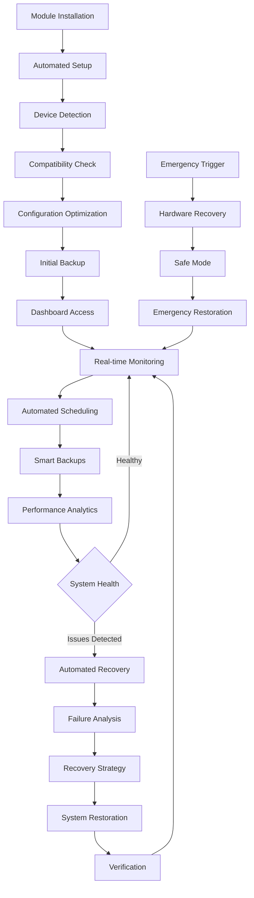

# KernelSU Anti-Bootloop & Backup Module - Comprehensive Automation & Improvement Plan

## 1. Product Overview

This document outlines a comprehensive automation and improvement plan for the KernelSU Anti-Bootloop & Backup module. The goal is to enhance automation, improve user experience, optimize performance, and add advanced features while maintaining stability and security.

## 2. Core Features

### 2.1 User Roles

| Role | Registration Method | Core Permissions |
|------|---------------------|------------------|
| Default User | Automatic on module installation | Full access to backup, restore, and monitoring features |
| Advanced User | Configuration file modification | Additional debugging, custom scripts, and advanced settings |
| Emergency Mode | Hardware button activation | Limited recovery and restoration capabilities |

### 2.2 Feature Module

Our enhanced module automation consists of the following main components:

1. **Intelligent Automation Dashboard**: Real-time monitoring, automated scheduling, smart notifications
2. **Advanced Backup Engine**: AI-powered backup optimization, incremental backups, cloud sync
3. **Enhanced WebUI Interface**: Modern React-based UI, real-time updates, mobile optimization
4. **Smart Recovery System**: Machine learning-based failure prediction, automated recovery workflows
5. **Performance Analytics**: Comprehensive metrics, performance optimization, resource monitoring
6. **CI/CD Pipeline Enhancement**: Automated testing, deployment, quality assurance
7. **Configuration Management**: Dynamic configuration, profile management, device-specific optimizations

### 2.3 Page Details

| Page Name | Module Name | Feature description |
|-----------|-------------|---------------------|
| **Automation Dashboard** | Real-time Monitoring | Display system health, backup status, automation schedules with live updates and interactive charts |
| **Automation Dashboard** | Smart Notifications | Push notifications, email alerts, webhook integrations for critical events and status changes |
| **Automation Dashboard** | Automated Scheduling | Intelligent backup scheduling based on usage patterns, battery level, and system load |
| **Advanced Backup Engine** | AI-Powered Optimization | Machine learning algorithms to optimize backup size, speed, and storage efficiency |
| **Advanced Backup Engine** | Incremental Backups | Delta-based backups, deduplication, compression optimization for minimal storage usage |
| **Advanced Backup Engine** | Cloud Sync Integration | Automatic cloud backup sync with Google Drive, Dropbox, and custom endpoints |
| **Enhanced WebUI** | Modern React Interface | Progressive Web App with Material Design 3, dark/light themes, responsive layout |
| **Enhanced WebUI** | Real-time Updates | WebSocket-based live updates, progress tracking, instant status notifications |
| **Enhanced WebUI** | Mobile Optimization | Touch-friendly interface, gesture controls, offline functionality |
| **Smart Recovery** | Failure Prediction | ML-based analysis of system patterns to predict and prevent bootloop scenarios |
| **Smart Recovery** | Automated Workflows | Self-healing mechanisms, automatic rollback, progressive recovery strategies |
| **Smart Recovery** | Emergency Protocols | Hardware button recovery, safe mode activation, emergency backup restoration |
| **Performance Analytics** | Comprehensive Metrics | CPU, memory, storage, network usage tracking with historical data and trends |
| **Performance Analytics** | Optimization Engine | Automatic performance tuning, resource allocation, background task management |
| **Performance Analytics** | Resource Monitoring | Real-time system monitoring, bottleneck detection, performance recommendations |
| **CI/CD Enhancement** | Automated Testing | Unit tests, integration tests, device compatibility testing, security scanning |
| **CI/CD Enhancement** | Quality Assurance | Code quality checks, performance benchmarks, security audits, compliance validation |
| **CI/CD Enhancement** | Deployment Automation | Automated releases, rollback capabilities, staged deployments, A/B testing |
| **Configuration Management** | Dynamic Configuration | Runtime configuration updates, profile switching, device-specific settings |
| **Configuration Management** | Profile Management | User profiles, backup profiles, recovery profiles with import/export functionality |
| **Configuration Management** | Device Optimization | Automatic device detection, manufacturer-specific optimizations, compatibility adjustments |

## 3. Core Process

### Main User Flow
1. **Installation & Setup**: Automated device detection → Compatibility check → Optimal configuration selection → Initial backup creation
2. **Daily Operations**: Background monitoring → Intelligent scheduling → Automated backups → Performance optimization → Health reporting
3. **Recovery Scenarios**: Failure detection → Automated diagnosis → Progressive recovery → User notification → System restoration
4. **Management & Monitoring**: Dashboard access → Real-time status → Configuration management → Performance analytics → Maintenance tasks

### Emergency Recovery Flow
1. **Hardware Trigger**: Volume button combination → Emergency mode activation → Safe environment setup
2. **Automated Recovery**: System analysis → Recovery point selection → Automated restoration → Verification → Normal mode return

## 4. User Interface Design

### 4.1 Design Style

- **Primary Colors**: Material Design 3 - Dynamic color system with #1976D2 (primary blue), #FF6B35 (accent orange)
- **Secondary Colors**: #F5F5F5 (light background), #212121 (dark background), #4CAF50 (success green), #F44336 (error red)
- **Button Style**: Material Design 3 elevated buttons with rounded corners (8px radius), subtle shadows, and ripple effects
- **Typography**: Roboto font family - 16px base size, 14px secondary, 12px captions, with proper contrast ratios
- **Layout Style**: Card-based design with 16dp spacing, responsive grid system, floating action buttons
- **Icons**: Material Design Icons with outlined style, 24px standard size, consistent visual weight
- **Animations**: Smooth transitions (300ms), fade-in effects, progress indicators, loading states

### 4.2 Page Design Overview

| Page Name | Module Name | UI Elements |
|-----------|-------------|-------------|
| **Automation Dashboard** | Status Cards | Material cards with elevation, real-time data, color-coded status indicators, progress bars |
| **Automation Dashboard** | Navigation Drawer | Collapsible sidebar with menu items, user profile, quick actions, theme toggle |
| **Automation Dashboard** | Action Bar | Top app bar with search, notifications, settings, responsive hamburger menu |
| **Advanced Backup** | Backup List | RecyclerView with swipe actions, backup thumbnails, size indicators, date stamps |
| **Advanced Backup** | Progress Tracking | Circular progress indicators, step-by-step wizards, real-time status updates |
| **Enhanced WebUI** | Responsive Layout | Flexbox-based responsive design, breakpoints at 768px and 1024px, mobile-first approach |
| **Enhanced WebUI** | Interactive Charts | Chart.js integration for analytics, real-time data visualization, touch interactions |
| **Smart Recovery** | Recovery Wizard | Step-by-step guided recovery, progress tracking, confirmation dialogs, rollback options |
| **Performance Analytics** | Metrics Dashboard | Real-time graphs, performance indicators, trend analysis, exportable reports |
| **Configuration** | Settings Panels | Organized settings groups, toggle switches, sliders, dropdown menus, validation feedback |

### 4.3 Responsiveness

The interface is designed mobile-first with progressive enhancement for larger screens. Touch interactions are optimized with 48dp minimum touch targets, gesture support for swipe actions, and haptic feedback integration. The WebUI automatically adapts to device orientation and screen density.

## 5. Implementation Priorities

### Phase 1: Core Automation (Immediate)
- Enhanced backup scheduling with intelligent timing
- Automated failure detection and recovery
- Performance monitoring and optimization
- WebUI improvements with real-time updates

### Phase 2: Advanced Features (Short-term)
- Machine learning integration for predictive analysis
- Cloud backup synchronization
- Advanced analytics and reporting
- Mobile app companion

### Phase 3: Ecosystem Integration (Long-term)
- Cross-device backup sharing
- Community features and module marketplace
- Advanced security features
- Enterprise management capabilities

## 6. Technical Specifications

### Automation Requirements
- Background service optimization with minimal battery impact
- Intelligent scheduling based on device usage patterns
- Real-time monitoring with configurable alert thresholds
- Automated testing and validation of backup integrity

### Performance Targets
- Backup creation: <2 minutes for full system backup
- Recovery time: <5 minutes for complete system restoration
- WebUI response time: <200ms for all interactions
- Memory usage: <50MB during normal operations

### Security Enhancements
- End-to-end encryption for all backup data
- Secure authentication with biometric support
- Audit logging for all system modifications
- Regular security updates and vulnerability scanning

This comprehensive plan will transform the KernelSU Anti-Bootloop & Backup module into a fully automated, intelligent, and user-friendly system that provides superior protection and management capabilities.