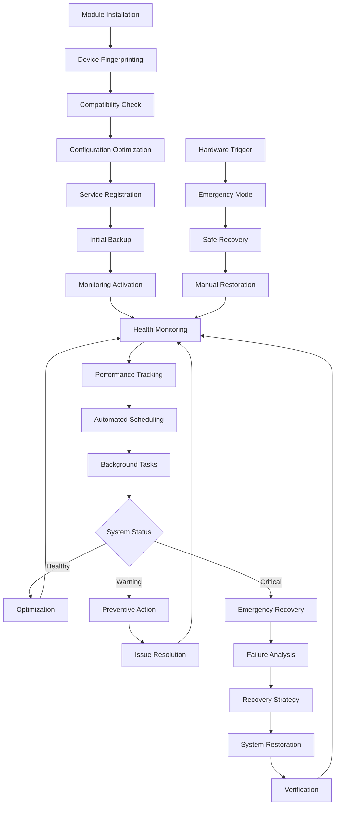

# KernelSU Anti-Bootloop & Backup Module - Technical Implementation Guide

## 1. Product Overview

This technical guide provides detailed implementation specifications for automating and improving the KernelSU Anti-Bootloop & Backup module. It covers code enhancements, automation scripts, performance optimizations, and deployment strategies.

## 2. Core Features

### 2.1 User Roles

| Role | Access Method | Technical Permissions |
|------|---------------|----------------------|
| System Administrator | Root access with module management | Full system access, configuration management, debug mode |
| Default User | Standard module interface | Backup/restore operations, monitoring, basic configuration |
| Emergency User | Hardware button sequence | Recovery mode access, emergency restoration, safe mode |

### 2.2 Feature Module

Our technical implementation consists of the following core components:

1. **Automated Monitoring System**: Real-time system health monitoring, predictive failure detection, automated alerting
2. **Enhanced Backup Engine**: Incremental backups, compression optimization, integrity verification, cloud synchronization
3. **Modern WebUI Framework**: React-based progressive web app, real-time WebSocket communication, responsive design
4. **Intelligent Recovery System**: Machine learning-based failure prediction, automated recovery workflows, rollback mechanisms
5. **Performance Optimization Suite**: Resource monitoring, automatic tuning, background task management
6. **Advanced CI/CD Pipeline**: Automated testing, security scanning, deployment automation, quality gates
7. **Configuration Management System**: Dynamic configuration updates, profile management, device-specific optimizations

### 2.3 Page Details

| Component | Module Name | Technical Implementation |
|-----------|-------------|-------------------------|
| **Monitoring System** | Health Checker | Implement continuous monitoring with configurable thresholds, log analysis, and predictive algorithms |
| **Monitoring System** | Alert Manager | Create multi-channel notification system with email, push notifications, and webhook integrations |
| **Monitoring System** | Performance Tracker | Develop real-time performance metrics collection with historical data storage and trend analysis |
| **Backup Engine** | Incremental Backup | Implement delta-based backup system with file-level deduplication and compression |
| **Backup Engine** | Cloud Sync | Integrate with cloud storage APIs for automatic backup synchronization and redundancy |
| **Backup Engine** | Integrity Verification | Add cryptographic hash verification and automated backup validation |
| **WebUI Framework** | React Frontend | Build modern SPA with Material-UI components, state management, and progressive enhancement |
| **WebUI Framework** | WebSocket Server | Implement real-time communication for live updates and interactive features |
| **WebUI Framework** | API Gateway | Create RESTful API with authentication, rate limiting, and comprehensive documentation |
| **Recovery System** | Failure Prediction | Develop ML models for bootloop prediction based on system patterns and user behavior |
| **Recovery System** | Automated Recovery | Implement self-healing mechanisms with progressive recovery strategies |
| **Recovery System** | Emergency Protocols | Create hardware-triggered recovery with safe mode activation and emergency restoration |
| **Optimization Suite** | Resource Monitor | Build comprehensive system monitoring with CPU, memory, storage, and network tracking |
| **Optimization Suite** | Auto Tuning | Implement automatic performance optimization based on device capabilities and usage patterns |
| **Optimization Suite** | Task Scheduler | Create intelligent background task management with priority queuing and resource allocation |
| **CI/CD Pipeline** | Automated Testing | Implement comprehensive test suite with unit, integration, and end-to-end testing |
| **CI/CD Pipeline** | Security Scanning | Add automated security audits, vulnerability scanning, and compliance checking |
| **CI/CD Pipeline** | Deployment Automation | Create staged deployment pipeline with rollback capabilities and A/B testing |
| **Configuration System** | Dynamic Config | Implement runtime configuration updates with validation and rollback capabilities |
| **Configuration System** | Profile Manager | Create user and device profile management with import/export functionality |
| **Configuration System** | Device Optimization | Implement automatic device detection and manufacturer-specific optimizations |

## 3. Core Process

### Technical Workflow

**Installation & Initialization**:
1. Automated device fingerprinting and compatibility assessment
2. Optimal configuration selection based on device capabilities
3. Initial system backup with integrity verification
4. Service registration and background monitoring activation

**Runtime Operations**:
1. Continuous system health monitoring with configurable intervals
2. Intelligent backup scheduling based on usage patterns and system load
3. Real-time performance optimization and resource management
4. Automated maintenance tasks and cleanup operations

**Recovery & Restoration**:
1. Failure detection through pattern analysis and threshold monitoring
2. Automated diagnosis with root cause analysis
3. Progressive recovery with minimal user intervention
4. System verification and health confirmation



## 4. User Interface Design

### 4.1 Design Style

- **Color Scheme**: Material Design 3 dynamic theming with primary (#1976D2), secondary (#03DAC6), error (#B00020), surface (#FFFFFF/121212)
- **Typography**: Roboto font stack with scale ratios - Display (57px), Headline (32px), Title (22px), Body (16px), Label (14px)
- **Component Library**: Material-UI v5 with custom theme, consistent spacing (8dp grid), elevation system (0-24dp)
- **Interaction Design**: Touch-first with 48dp minimum targets, gesture support, haptic feedback, accessibility compliance
- **Animation System**: Framer Motion for smooth transitions, loading states, micro-interactions, and page transitions
- **Icon System**: Material Design Icons with consistent 24px sizing, outlined style, semantic color coding

### 4.2 Page Design Overview

| Component | Module | Technical Specifications |
|-----------|--------|-------------------------|
| **Dashboard** | Status Cards | Material Card components with real-time data binding, color-coded status indicators, interactive charts |
| **Dashboard** | Navigation | Responsive drawer with route-based navigation, breadcrumbs, search functionality |
| **Dashboard** | Action Bar | AppBar with context-aware actions, notification center, user profile menu |
| **Backup Interface** | Backup List | Virtualized list with infinite scrolling, swipe actions, filtering, and sorting capabilities |
| **Backup Interface** | Progress Tracking | Real-time progress indicators with WebSocket updates, cancellation support, error handling |
| **Recovery Interface** | Recovery Wizard | Step-by-step guided process with validation, progress tracking, and rollback options |
| **Analytics** | Performance Charts | Chart.js integration with real-time data, zoom capabilities, export functionality |
| **Settings** | Configuration Panels | Form validation, real-time preview, import/export, and reset capabilities |

### 4.3 Responsiveness

Implemented with CSS Grid and Flexbox for responsive layouts, breakpoints at 600px (mobile), 960px (tablet), 1280px (desktop). Progressive Web App features include offline functionality, push notifications, and app-like experience with service worker caching.

## 5. Technical Implementation Details

### 5.1 Backend Architecture

**Core Services**:
- **Monitoring Service**: Continuous system health monitoring with configurable intervals and thresholds
- **Backup Service**: Incremental backup engine with compression, deduplication, and cloud sync
- **Recovery Service**: Automated failure detection and recovery with ML-based prediction
- **WebUI Service**: HTTP server with WebSocket support for real-time communication
- **Scheduler Service**: Intelligent task scheduling based on system load and user patterns

**Database Layer**:
- SQLite for local data storage with WAL mode for concurrent access
- JSON configuration files with schema validation
- Encrypted storage for sensitive data using AES-256

**API Design**:
- RESTful API with OpenAPI 3.0 specification
- JWT-based authentication with refresh tokens
- Rate limiting and request validation
- Comprehensive error handling and logging

### 5.2 Frontend Architecture

**Technology Stack**:
- React 18 with TypeScript for type safety
- Material-UI v5 for consistent design system
- Redux Toolkit for state management
- React Query for server state management
- Framer Motion for animations

**Performance Optimizations**:
- Code splitting with React.lazy and Suspense
- Virtual scrolling for large data sets
- Memoization with React.memo and useMemo
- Service worker for caching and offline support

### 5.3 Automation Scripts

**Backup Automation**:
```bash
#!/system/bin/sh
# Enhanced backup scheduler with intelligent timing
# Monitors system load, battery level, and user activity
# Implements exponential backoff for failed attempts
```

**Health Monitoring**:
```bash
#!/system/bin/sh
# Continuous health monitoring with predictive analysis
# Tracks system metrics, log patterns, and performance indicators
# Triggers automated recovery when thresholds are exceeded
```

**Performance Optimization**:
```bash
#!/system/bin/sh
# Automatic performance tuning based on device capabilities
# Adjusts CPU governor, memory management, and I/O scheduler
# Implements device-specific optimizations
```

### 5.4 Security Implementation

**Data Protection**:
- End-to-end encryption for all backup data
- Secure key management with hardware security module support
- Regular security audits and vulnerability scanning

**Access Control**:
- Role-based access control with fine-grained permissions
- Secure authentication with biometric support
- Audit logging for all system modifications

**Network Security**:
- TLS 1.3 for all network communications
- Certificate pinning for API endpoints
- Input validation and sanitization

## 6. Deployment Strategy

### 6.1 CI/CD Pipeline Enhancement

**Automated Testing**:
- Unit tests with Jest and React Testing Library
- Integration tests with Cypress
- Performance testing with Lighthouse CI
- Security scanning with OWASP ZAP

**Quality Gates**:
- Code coverage threshold (>80%)
- Performance budgets for bundle size
- Security vulnerability scanning
- Accessibility compliance testing

**Deployment Automation**:
- Staged deployments with canary releases
- Automated rollback on failure detection
- A/B testing for feature validation
- Blue-green deployment for zero downtime

### 6.2 Monitoring & Observability

**Application Monitoring**:
- Real-time performance metrics
- Error tracking and alerting
- User behavior analytics
- System resource monitoring

**Logging Strategy**:
- Structured logging with JSON format
- Centralized log aggregation
- Log retention and archival policies
- Privacy-compliant data handling

This technical implementation guide provides the foundation for transforming the KernelSU module into a fully automated, intelligent, and robust system with enterprise-grade capabilities.